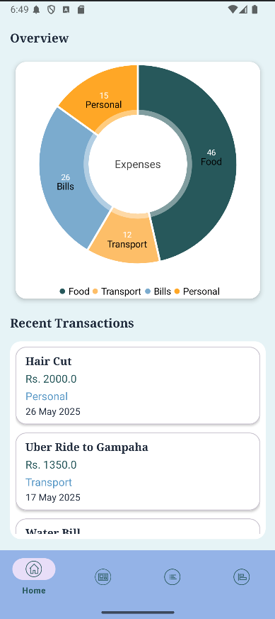
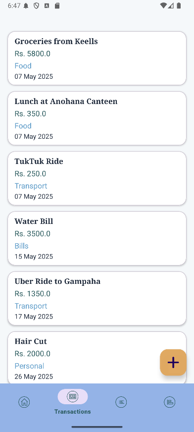
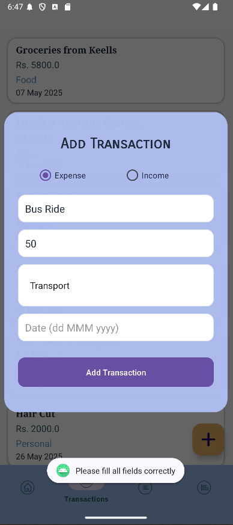
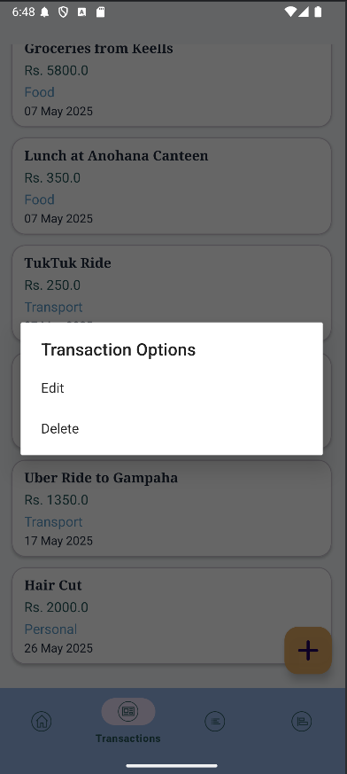
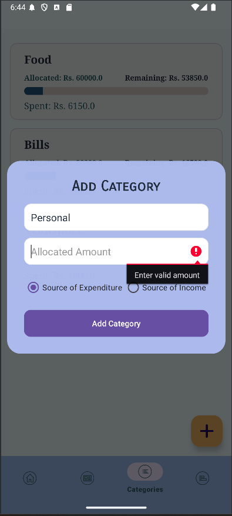
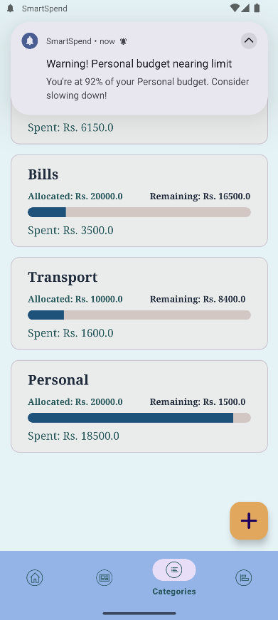
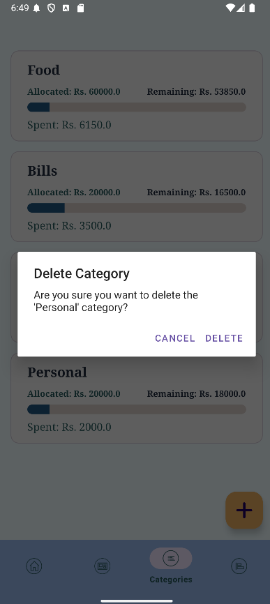

# SmartSpend
SmartSpend is a mobile app I created to keep track of your money. Below are screenshots of my app.

Here’s a clean, professional **README.md** for your Android app **SmartSpend** — written in a style ideal for GitHub or a university project submission 👇

---

# 💰 SmartSpend — Personal Finance Tracker

**SmartSpend** is a simple yet powerful Android application designed to help users track their daily expenses, manage budgets, and gain better control over their personal finances. With an intuitive interface and insightful analytics, SmartSpend makes money management effortless and accessible.

---

## 📱 Features

* **💸 Expense Tracking:** Quickly record daily expenses and categorize them (e.g., food, travel, bills, shopping).
* **📊 Budget Planning:** Set monthly budgets and monitor how much you’ve spent versus how much remains.
* **📅 History & Reports:** View past spending patterns with organized summaries and charts.
* **📈 Insights Dashboard:** Visualize your financial habits using interactive pie charts and line graphs.
* **🔔 Smart Reminders:** Get notified to log expenses and stay within your budget.
* **☁️ Data Backup:** Option to back up your financial data locally or via cloud storage.
* **🎨 Clean UI:** Minimal, responsive, and user-friendly interface with light and dark themes.

---

## 🧠 Motivation

Managing finances can be overwhelming, especially for students or young professionals. **SmartSpend** was built to simplify this process — making it easier to **track spending, understand financial habits, and make informed decisions** about where your money goes.

---

## ⚙️ Tech Stack

* **Language:** Kotlin / Java
* **Framework:** Android SDK
* **Database:** Room / SQLite
* **Architecture:** MVVM (Model–View–ViewModel)
* **UI:** Material Design Components
* **Charts & Analytics:** MPAndroidChart
* **Notifications:** Android AlarmManager & WorkManager

---

## 🚀 Installation

1. **Clone the repository**

   ```bash
   git clone https://github.com/yourusername/SmartSpend.git
   ```
2. **Open in Android Studio**

   * Open the project in **Android Studio**.
3. **Build & Run**

   * Connect your Android device or use an emulator.
   * Click **Run ▶️** to launch SmartSpend.

---

## 📂 Project Structure

```
SmartSpend/
│
├── app/
│   ├── java/com/smartspend/...
│   │   ├── ui/               # Activities, Fragments, Adapters
│   │   ├── data/             # Models, DAOs, Room Database
│   │   ├── viewmodel/        # Business logic
│   │   └── utils/            # Helpers and constants
│   └── res/                  # Layouts, Drawables, Strings, Themes
│
├── build.gradle
├── README.md
└── LICENSE
```

---

## 🖼️ Screenshots

| Dashboard                          | Tansactions                            | Add Transaction                |
| ---------------------------------- | -------------------------------------- | ------------------------------ |
|     |         | |

| Transaction Options                | Add Category                           | Categories + Warning Notifications |
| ---------------------------------- | -------------------------------------- | ---------------------------------- |
|     |         |     |

| Add Category                       | Delete Category                        | Categories + Warning Notifications |
| ---------------------------------- | -------------------------------------- | ---------------------------------- |
|     |         |     |


---

## 🔒 Privacy & Data

SmartSpend stores all user data securely on the device (or optionally in the cloud). No personal or financial data is shared with third parties.

---

## 🧩 Future Enhancements

* 💳 Integration with bank APIs for automatic expense tracking
* 🌐 Cloud sync across multiple devices
* 📥 Export reports as PDF/CSV
* 🤖 AI-based spending recommendations

---

## 👨‍💻 Developed By

**[Your Name]**
📧 [[your.email@example.com](mailto:your.email@example.com)]
🧾 Project for [Your University / Course Name]
📅 Year: 2025

---

## 🪪 License

This project is licensed under the **MIT License** — see the [LICENSE](LICENSE) file for details.

---

Would you like me to adapt this for **GitHub style (with badges, icons, and shields)** or for a **university submission format (cleaner, PDF-style without markdown icons)?**


